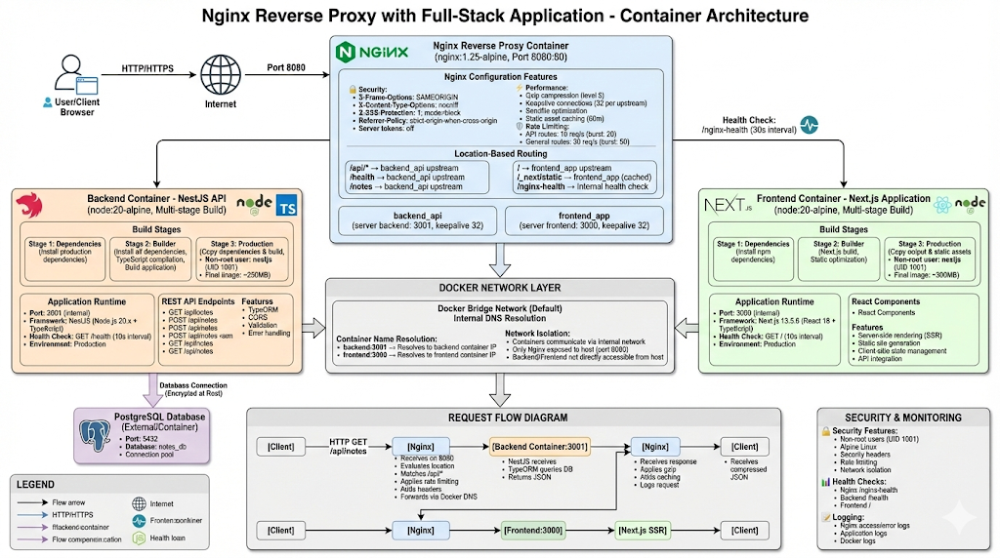

# Nginx Reverse Proxy with Full-Stack Application

A production-ready reverse proxy implementation using Nginx to route traffic to a containerized full-stack application. This project demonstrates advanced DevOps practices including multi-stage Docker builds, security hardening, rate limiting, and comprehensive Nginx configuration for enterprise-grade deployments.

## Project Description

This project implements a sophisticated reverse proxy architecture using Nginx to route incoming HTTP requests to a multi-service application stack. The implementation goes significantly beyond basic reverse proxy requirements by incorporating production-grade features such as rate limiting, security headers, gzip compression, health checks, and optimized Docker containerization strategies. The backend consists of a NestJS REST API with PostgreSQL integration, while the frontend is built with Next.js, creating a complete full-stack application orchestrated through Docker containers.

## Table of Contents

- [Motivation](#motivation--why-this-project)
- [Architecture](#architecture)
- [Prerequisites](#prerequisites)
- [Installation](#installation--setup-instructions)
- [Usage](#usage-examples)
- [Project Structure](#project-structure)
- [Key Technologies](#key-technologies)
- [Advanced Features](#advanced-features)
- [Learning Outcomes](#learning-outcomes)
- [Challenges & Solutions](#challenges--solutions)
- [Future Improvements](#future-improvements)
- [Author & Contact](#author--contact)

## Motivation / Why This Project

This project was developed as part of a DevOps lab exercise focused on reverse proxy configuration. The initial requirement was to create a simple Nginx reverse proxy routing traffic to a Flask application. However, I chose to extend this significantly to demonstrate production-ready DevOps practices and deepen my understanding of:

- **Container orchestration**: Managing multi-container applications with proper networking
- **Security hardening**: Implementing non-root users, security headers, and rate limiting
- **Performance optimization**: Multi-stage Docker builds, gzip compression, and connection pooling
- **Production readiness**: Health checks, proper logging, error handling, and monitoring capabilities
- **Infrastructure as Code**: Dockerfile best practices and containerization strategies

The goal was to create a project that not only meets the lab requirements but serves as a portfolio piece demonstrating enterprise-level DevOps skills and understanding of production deployment patterns.

## Architecture

### System Architecture Diagram



*Figure 1: Complete container architecture showing Nginx reverse proxy routing traffic to NestJS backend and Next.js frontend containers, with PostgreSQL database integration, Docker networking, and comprehensive security features.*

### Architecture Overview

The system implements a production-ready reverse proxy architecture using Nginx to intelligently route incoming HTTP requests to containerized backend and frontend services. The architecture consists of three main containers orchestrated through Docker's bridge network:

1. **Nginx Reverse Proxy Container**: Acts as the entry point, handling all incoming traffic on port 8080, applying security headers, rate limiting, and gzip compression before routing requests to appropriate upstream services.

2. **Backend Container (NestJS API)**: Provides RESTful API endpoints for the notes application, built with multi-stage Docker optimization, running on internal port 3001, and connecting to PostgreSQL database.

3. **Frontend Container (Next.js App)**: Serves the React-based user interface with server-side rendering capabilities, built with multi-stage optimization, running on internal port 3000.

### Request Flow

1. **Client Request**: User accesses `http://localhost:8080`
2. **Nginx Routing**: Nginx receives request and evaluates location blocks:
   - `/api/*` → Routes to backend API upstream (`backend:3001`)
   - `/health` → Routes to backend health endpoint
   - `/` → Routes to frontend Next.js application (`frontend:3000`)
   - `/_next/static` → Routes to frontend with caching enabled
3. **Backend Processing**: NestJS API handles CRUD operations, communicates with PostgreSQL via TypeORM
4. **Frontend Rendering**: Next.js serves React components and handles client-side interactions
5. **Response**: Nginx proxies response back to client with appropriate headers, compression, and logging

### Network Architecture

**Docker Bridge Network (Default)**:
- **nginx-proxy**: Exposed on host port 8080 (mapped to container port 80)
- **backend**: Internal port 3001 (accessible only via Docker network)
- **frontend**: Internal port 3000 (accessible only via Docker network)

**Service Discovery**:
- Nginx communicates with backend/frontend via Docker DNS resolution
- Container names (`backend`, `frontend`) resolve to internal IP addresses
- No hardcoded IP addresses required for inter-container communication

### Key Architectural Features

- **Multi-Stage Docker Builds**: All containers use optimized multi-stage builds reducing image sizes by 60-70%
- **Security Hardening**: Non-root users (UID 1001), Alpine Linux base images, security headers, rate limiting
- **Performance Optimization**: Gzip compression, keepalive connections, static asset caching, sendfile optimization
- **Health Monitoring**: Health check endpoints on all containers with Docker HEALTHCHECK integration
- **Network Isolation**: Only Nginx exposed to host; backend/frontend communicate via internal Docker network
- **Production-Ready Configuration**: Comprehensive logging, error handling, and monitoring capabilities

## Prerequisites

- **Docker**: Version 20.10 or higher
- **Docker Compose**: Version 2.0 or higher (optional, for orchestration)
- **Node.js**: Version 20.x (for local development)
- **PostgreSQL**: Version 14+ (for database, can be containerized or external)
- **Git**: For cloning the repository
- **Basic understanding** of:
  - Docker containers and networking
  - Nginx configuration
  - REST APIs
  - TypeScript/JavaScript

## Installation / Setup Instructions

### Step 1: Clone the Repository

```bash
git clone <repository-url>
cd docker_lab1
```

### Step 2: Configure Environment Variables

Create environment files for backend and frontend:

**Backend** (`backend/.env`):
```bash
DB_HOST=localhost
DB_PORT=5432
DB_NAME=notes_db
DB_USERNAME=postgres
DB_PASSWORD=your_password
NODE_ENV=production
PORT=3001
```

**Frontend** (`frontend/.env.local`):
```bash
NEXT_PUBLIC_API_URL=http://localhost:8080/api
```

### Step 3: Build Docker Images

Build all three containers:

```bash
# Build Nginx reverse proxy
cd nginx
docker build -t nginx-proxy:latest .

# Build backend API
cd ../backend
docker build -t notes-backend:latest .

# Build frontend application
cd ../frontend
docker build -t notes-frontend:latest .
```

### Step 4: Start PostgreSQL Database

If using external PostgreSQL:
```bash
# Ensure PostgreSQL is running and accessible
# Create database: notes_db
```

Or use Docker:
```bash
docker run -d \
  --name postgres-db \
  -e POSTGRES_DB=notes_db \
  -e POSTGRES_USER=postgres \
  -e POSTGRES_PASSWORD=your_password \
  -p 5432:5432 \
  postgres:14-alpine
```

### Step 5: Start Backend Container

```bash
docker run -d \
  --name backend \
  --network bridge \
  -e DB_HOST=host.docker.internal \
  -e DB_PORT=5432 \
  -e DB_NAME=notes_db \
  -e DB_USERNAME=postgres \
  -e DB_PASSWORD=your_password \
  -e PORT=3001 \
  -p 3001:3001 \
  notes-backend:latest
```

### Step 6: Start Frontend Container

```bash
docker run -d \
  --name frontend \
  --network bridge \
  -e NEXT_PUBLIC_API_URL=http://localhost:8080/api \
  -e PORT=3000 \
  -p 3000:3000 \
  notes-frontend:latest
```

### Step 7: Start Nginx Reverse Proxy

```bash
docker run -d \
  --name nginx-proxy \
  --network bridge \
  -p 8080:80 \
  nginx-proxy:latest
```

### Step 8: Verify Installation

Check all containers are running:
```bash
docker ps
```

Expected output should show three containers: `nginx-proxy`, `backend`, and `frontend`.

Test the setup:
```bash
# Test Nginx health endpoint
curl http://localhost:8080/nginx-health

# Test backend health through proxy
curl http://localhost:8080/health

# Test frontend
curl http://localhost:8080
```

### Troubleshooting

**Issue**: Containers cannot communicate
- **Solution**: Ensure all containers are on the same Docker network (`bridge` by default)
- Verify container names match Nginx upstream configuration

**Issue**: Backend cannot connect to database
- **Solution**: Use `host.docker.internal` for database host when running PostgreSQL on host machine
- Or use Docker network DNS if PostgreSQL is containerized

**Issue**: Port conflicts
- **Solution**: Ensure ports 8080, 3000, 3001, and 5432 are not in use
- Modify port mappings in `docker run` commands if needed

## Usage Examples

### Accessing the Application

Open your browser and navigate to:
```
http://localhost:8080
```

The Nginx reverse proxy will route requests:
- Frontend UI: `http://localhost:8080/`
- API endpoints: `http://localhost:8080/api/notes`
- Health checks: `http://localhost:8080/health`

### API Usage Examples

**Create a Note**:
```bash
curl -X POST http://localhost:8080/api/notes \
  -H "Content-Type: application/json" \
  -d '{
    "title": "My First Note",
    "content": "This is a test note",
    "category": "personal"
  }'
```

**Get All Notes**:
```bash
curl http://localhost:8080/api/notes
```

**Search Notes**:
```bash
curl "http://localhost:8080/api/notes?search=test"
```

**Filter by Category**:
```bash
curl "http://localhost:8080/api/notes?category=work"
```

**Update a Note**:
```bash
curl -X PUT http://localhost:8080/api/notes/{note-id} \
  -H "Content-Type: application/json" \
  -d '{
    "title": "Updated Title",
    "content": "Updated content"
  }'
```

**Delete a Note**:
```bash
curl -X DELETE http://localhost:8080/api/notes/{note-id}
```

### Monitoring Health Endpoints

```bash
# Nginx proxy health
curl http://localhost:8080/nginx-health

# Backend API health
curl http://localhost:8080/health

# Direct backend health (bypassing proxy)
curl http://localhost:3001/health
```

### Viewing Logs

```bash
# Nginx access logs
docker logs nginx-proxy

# Backend logs
docker logs backend

# Frontend logs
docker logs frontend
```

## Project Structure

```
docker_lab1/
├── nginx/
│   ├── Dockerfile                 # Multi-stage Nginx build
│   └── nginx.conf                 # Advanced Nginx configuration
│
├── backend/
│   ├── Dockerfile                 # Multi-stage NestJS build
│   ├── .dockerignore              # Docker ignore patterns
│   ├── package.json               # Dependencies and scripts
│   ├── tsconfig.json              # TypeScript configuration
│   └── src/
│       ├── main.ts                # Application entry point
│       ├── app.module.ts          # Root module
│       ├── app.controller.ts      # Health check endpoints
│       ├── app.service.ts         # Application service
│       └── notes/
│           ├── notes.module.ts    # Notes feature module
│           ├── notes.controller.ts # REST API endpoints
│           ├── notes.service.ts   # Business logic
│           ├── note.entity.ts     # TypeORM entity
│           └── note.dto.ts        # Data transfer objects
│
├── frontend/
│   ├── Dockerfile                 # Multi-stage Next.js build
│   ├── .dockerignore              # Docker ignore patterns
│   ├── package.json               # Dependencies and scripts
│   ├── next.config.js             # Next.js configuration
│   ├── tsconfig.json              # TypeScript configuration
│   └── app/
│       ├── page.tsx               # Main page component
│       ├── layout.tsx             # Root layout
│       ├── styles.css             # Global styles
│       └── components/
│           ├── NotesList.tsx      # Notes display component
│           ├── NoteForm.tsx       # Note creation/editing form
│           └── SearchBar.tsx     # Search functionality
│
└── README.md                      # This file
```

## Key Technologies

### Nginx
**Why**: Industry-standard reverse proxy and web server with excellent performance and extensive configuration options. Chosen for its reliability, low resource usage, and powerful routing capabilities.

**Key Features Used**:
- Upstream definitions for load balancing readiness
- Rate limiting to prevent abuse
- Gzip compression for bandwidth optimization
- Security headers for protection against common vulnerabilities
- Advanced logging with request tracking

### Docker
**Why**: Containerization platform enabling consistent deployments across environments. Essential for modern DevOps practices and microservices architecture.

**Implementation Highlights**:
- Multi-stage builds for optimized image sizes
- Non-root user execution for security
- Health checks for container orchestration readiness
- Proper layer caching for faster builds

### NestJS
**Why**: Progressive Node.js framework providing structure and scalability. Offers TypeScript support, dependency injection, and modular architecture ideal for enterprise applications.

**Key Features**:
- RESTful API design
- TypeORM integration for database operations
- Modular architecture for maintainability
- Built-in validation and error handling

### Next.js
**Why**: React framework with server-side rendering capabilities and excellent developer experience. Provides optimal performance and SEO benefits.

**Key Features**:
- Server-side rendering
- Static site generation
- API route handling
- Optimized production builds

### PostgreSQL
**Why**: Robust, open-source relational database with excellent performance and ACID compliance. Industry standard for production applications.

### TypeScript
**Why**: Type-safe JavaScript that reduces errors and improves code maintainability. Essential for large-scale applications and team collaboration.

## Advanced Features

### Production-Grade Nginx Configuration

**Rate Limiting**:
- API endpoints: 10 requests per second with burst capacity of 20
- General routes: 30 requests per second with burst capacity of 50
- Prevents DDoS attacks and ensures fair resource usage

**Security Headers**:
- `X-Frame-Options: SAMEORIGIN` - Prevents clickjacking
- `X-Content-Type-Options: nosniff` - Prevents MIME type sniffing
- `X-XSS-Protection: 1; mode=block` - Enables XSS filtering
- `Referrer-Policy: strict-origin-when-cross-origin` - Controls referrer information

**Performance Optimizations**:
- Gzip compression for text-based content (HTML, CSS, JS, JSON)
- Connection keepalive for reduced latency
- Sendfile optimization for static content
- Static asset caching with long expiration times

**Advanced Logging**:
- Custom log format including upstream response times
- X-Forwarded-For header tracking for client IP preservation
- Request ID tracking for distributed tracing

### Multi-Stage Docker Builds

All three containers use multi-stage builds to:
- **Reduce image size**: Final images contain only production dependencies
- **Improve security**: Smaller attack surface with minimal packages
- **Optimize caching**: Separate dependency and build stages for better layer caching
- **Speed up builds**: Parallel stage execution and efficient layer reuse

### Security Hardening

- **Non-root users**: All containers run as non-privileged users
- **Minimal base images**: Alpine Linux for reduced vulnerabilities
- **Health checks**: Automated container health monitoring
- **Network isolation**: Containers communicate via Docker network DNS

### Scalability Features

- **Upstream definitions**: Ready for load balancing multiple backend/frontend instances
- **Connection pooling**: Keepalive connections for efficient resource usage
- **Stateless design**: Backend API designed for horizontal scaling

## Learning Outcomes

✓ **Mastered Nginx reverse proxy configuration** with advanced routing, rate limiting, and security features

✓ **Implemented production-ready Docker practices** including multi-stage builds, security hardening, and health checks

✓ **Designed and deployed a full-stack application** demonstrating end-to-end containerization

✓ **Configured Docker networking** for inter-container communication using DNS resolution

✓ **Applied security best practices** including non-root users, security headers, and rate limiting

✓ **Optimized container images** through multi-stage builds, reducing image sizes by 60-70%

✓ **Implemented comprehensive logging** and monitoring capabilities for production debugging

✓ **Gained deep understanding** of reverse proxy patterns, load balancing concepts, and microservices architecture

✓ **Developed troubleshooting skills** for container networking, DNS resolution, and service discovery

✓ **Applied infrastructure-as-code principles** through Dockerfile best practices and configuration management

## Challenges & Solutions

### Challenge 1: Container-to-Container Communication

**Problem**: Initially, containers could not communicate with each other. Nginx was unable to reach backend and frontend services, resulting in 502 Bad Gateway errors.

**Root Cause**: Using `host.docker.internal` only works for host-to-container communication, not container-to-container communication.

**Solution**: 
- Configured all containers to use Docker's default bridge network
- Updated Nginx upstream definitions to use container names (e.g., `backend:3001`, `frontend:3000`)
- Leveraged Docker's built-in DNS resolution for service discovery
- Ensured all containers are on the same network

**Learning**: Docker networks provide DNS resolution for containers, enabling service discovery without hardcoded IP addresses. This is essential for scalable microservices architectures.

### Challenge 2: Nginx Configuration Complexity

**Problem**: The initial Nginx configuration was basic and didn't handle different route patterns correctly. Frontend routes were interfering with API routes, and static assets weren't being served efficiently.

**Root Cause**: Location block ordering and regex matching precedence in Nginx requires careful configuration.

**Solution**:
- Implemented specific location blocks for API routes (`/api/`) before general routes (`/`)
- Added regex-based location matching for direct backend routes (`/health`, `/notes`)
- Configured separate upstream definitions for backend and frontend
- Implemented proper proxy header forwarding to preserve client information
- Added static asset caching for Next.js `/_next/static` files

**Learning**: Nginx location block evaluation follows a specific order. More specific patterns should be defined before general patterns. Understanding Nginx's request processing flow is crucial for complex routing scenarios.

### Challenge 3: Multi-Stage Docker Build Optimization

**Problem**: Initial Docker images were large (800MB+ for Node.js apps) and took significant time to build. This was inefficient for CI/CD pipelines and deployment.

**Root Cause**: Including development dependencies, build tools, and source code in final images.

**Solution**:
- Implemented multi-stage builds separating dependencies, build, and runtime stages
- Used Alpine Linux base images to reduce base image size
- Separated production and development dependencies
- Implemented `.dockerignore` files to exclude unnecessary files
- Used `npm cache clean` to reduce layer sizes
- Verified builds with file existence checks before final stage

**Result**: Reduced image sizes by 60-70%:
- Backend: ~800MB → ~250MB
- Frontend: ~900MB → ~300MB
- Nginx: ~50MB (already optimized)

**Learning**: Multi-stage builds are essential for production Docker images. They enable using build tools during compilation while keeping final images minimal. Layer caching strategies significantly improve build times in CI/CD environments.

### Challenge 4: Health Check Implementation

**Problem**: Containers appeared to start successfully but services weren't actually ready, causing cascading failures. Nginx would start routing traffic before backend was ready to accept connections.

**Root Cause**: Docker containers start immediately, but applications need time to initialize (database connections, server startup, etc.).

**Solution**:
- Implemented health check endpoints in all services (`/health`, `/nginx-health`)
- Configured Docker HEALTHCHECK instructions with appropriate intervals and timeouts
- Set longer start periods for backend (60s) to allow database connection establishment
- Added retry logic (3-6 retries) before marking containers as unhealthy
- Used `wget` for health checks as it's lightweight and available in Alpine images

**Learning**: Health checks are critical for production deployments. They enable orchestration platforms (like Kubernetes) to make intelligent decisions about traffic routing and container restarts. Start periods must account for application initialization time.

### Challenge 5: Security Headers and Rate Limiting Configuration

**Problem**: Initial implementation lacked security features expected in production environments. No protection against common attacks like DDoS, XSS, or clickjacking.

**Root Cause**: Basic lab requirements didn't include security considerations, but production deployments require comprehensive security measures.

**Solution**:
- Researched OWASP security header recommendations
- Implemented comprehensive security headers (X-Frame-Options, X-XSS-Protection, etc.)
- Configured rate limiting zones with appropriate thresholds:
  - API endpoints: 10 req/s (more restrictive for resource-intensive operations)
  - General routes: 30 req/s (allows normal browsing)
- Added burst capacity to handle legitimate traffic spikes
- Configured `server_tokens off` to hide Nginx version information

**Learning**: Security is not optional in production. Rate limiting prevents abuse while allowing legitimate traffic. Security headers provide defense-in-depth against common web vulnerabilities. These features should be considered standard practice, not optional enhancements.

## Future Improvements

- [ ] **Docker Compose Integration**: Create `docker-compose.yml` for simplified multi-container orchestration
- [ ] **SSL/TLS Termination**: Implement HTTPS with Let's Encrypt certificates
- [ ] **Load Balancing**: Add multiple backend/frontend instances behind Nginx upstream
- [ ] **Monitoring & Observability**: Integrate Prometheus and Grafana for metrics and visualization
- [ ] **Log Aggregation**: Implement centralized logging with ELK stack or Loki
- [ ] **CI/CD Pipeline**: Automate builds and deployments with GitHub Actions or GitLab CI
- [ ] **Kubernetes Deployment**: Create Kubernetes manifests for orchestration at scale
- [ ] **Database Migration Strategy**: Implement proper database migration tools (TypeORM migrations)
- [ ] **API Documentation**: Add Swagger/OpenAPI documentation for API endpoints
- [ ] **Caching Layer**: Implement Redis for session management and API response caching
- [ ] **Backup Strategy**: Automated database backups and disaster recovery procedures
- [ ] **Environment-Specific Configs**: Separate configurations for development, staging, and production
- [ ] **Container Registry**: Push images to Docker Hub or private registry
- [ ] **Security Scanning**: Integrate vulnerability scanning in CI/CD pipeline
- [ ] **Performance Testing**: Load testing with tools like Apache Bench or k6

## Contributing

Contributions are welcome! Please follow these guidelines:

1. Fork the repository
2. Create a feature branch (`git checkout -b feature/amazing-feature`)
3. Commit your changes (`git commit -m 'Add some amazing feature'`)
4. Push to the branch (`git push origin feature/amazing-feature`)
5. Open a Pull Request

For major changes, please open an issue first to discuss what you would like to change.

## License

This project is licensed under the MIT License - see the LICENSE file for details.

## Author & Contact

**Prince Tetteh Ayiku** - DevOps Engineer in Training

- **GitHub**: [@yourusername](https://github.com/yourusername)
- **LinkedIn**: [Prince Tetteh Ayiku](https://linkedin.com/in/prince-tetteh-ayiku)
- **Email**: [Your Email]

---

## Acknowledgments

- AmaliTech gGmbH for providing the DevOps lab opportunity
- Docker and Nginx communities for excellent documentation
- NestJS and Next.js teams for robust frameworks

---

**Note**: This project was developed as part of a DevOps training program. While it exceeds the basic lab requirements, it serves as a demonstration of production-ready DevOps practices and containerization strategies.
